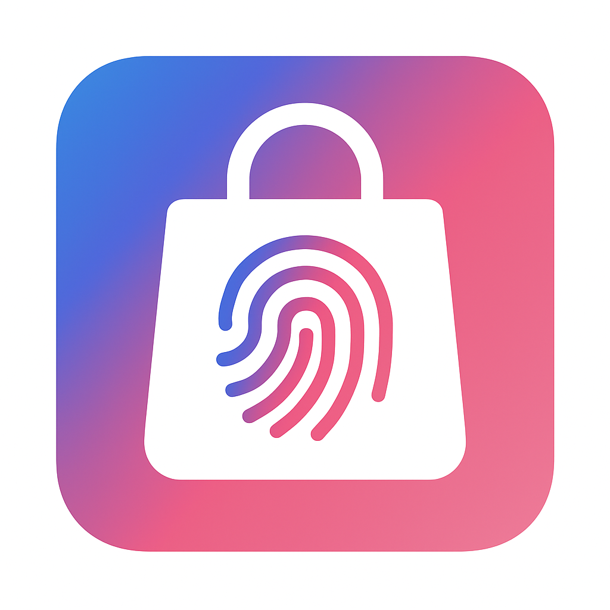

# 🌸 Flower Store — React Native Coding Challenge

<p align="center">
  
</p>

A visually polished React Native app that blends smooth navigation, biometric security, and offline product browsing — built for speed, clarity, and real-world usability.

---

## 🚀 Getting Started

This project was bootstrapped using [**React Native CLI**](https://github.com/react-native-community/cli).
Before running the app, make sure you've completed the [environment setup guide](https://reactnative.dev/docs/set-up-your-environment).

---

### 1️⃣ Start Metro

Metro is the JavaScript bundler for React Native.
To start it, run:

```bash
npm start
# or
yarn start
```

---

### 2️⃣ Build & Run the App

#### ✅ Android

```bash
npm run android
# or
yarn android
```

#### ✅ iOS (macOS only)

Make sure CocoaPods are installed:

```bash
bundle install
bundle exec pod install
```

Then run:

```bash
npm run ios
# or
yarn ios
```

---

## ✅ Setup & How to Run

```bash
npm install
npx react-native run-android
```

---

## 🛍️ Chosen Category

**Specific Category Screen:** `fragrances`

---

## 👑 Superadmin User

**Username:** `admin`
**Password:** `admin123`

> Superadmin users can delete products from the **All Products** screen.

---

## ✨ Features

* 🔐 Login screen with DummyJSON authentication
* 🛒 All Products screen (delete option for superadmin)
* 🏷️ Specific Category screen with pull-to-refresh
* ⏱️ Auto-lock after 10 seconds of inactivity or background
* 👆 Unlock via biometrics with manual fallback
* 📶 Offline support using React Query + MMKV

---

## ⚖️ Trade-offs

* Skipped dark mode and advanced error UI due to time constraints
* Manual unlock is a placeholder (no password screen yet)
* No unit tests or automated validation

---

## 💡 If I Had More Time

* Add a proper password fallback screen for biometric failure
* Improve error handling with toast messages
* Add dark mode and theme switching
* Write unit tests and integrate CI

---

## 🧰 Tech Stack

* **React Native**
* **TypeScript**
* **React Navigation**
* **React Query**
* **MMKV**
* **Redux Toolkit**
* **react-native-biometrics**

---

## 🖌️ Design

* Soft pink & lavender color palette for a feminine, modern look
* Rounded product cards with subtle shadows
* Clean and minimalist UI inspired by real-world e-commerce apps
* Responsive layout that adapts smoothly across devices
